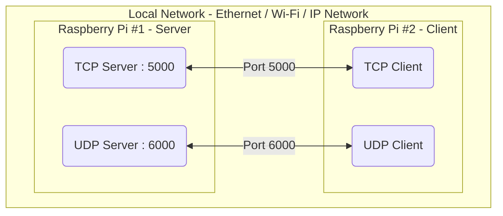

# Implementation and Demonstration of TCP and UDP Client-Server Communication Between Two Raspberry Pi Devices

## 1. Project Title
Implementation and Demonstration of TCP and UDP Client-Server Communication Between Two Raspberry Pi Devices.

## 2. Project Overview
This project provides a beginner-friendly, professionally structured C++ networking demonstration. It implements fundamental TCP and UDP client-server communication using POSIX socket APIs on Raspberry Pi OS/Linux.

## 3. Objective
The main objective is to demonstrate the differences between TCP (connection-oriented) and UDP (connectionless) communication by implementing practical examples in C++ that can be built and run on physical Raspberry Pi hardware. This demonstrates basic network programming skills relevant to embedded and systems engineering.

## 4. Learning Outcomes
- Understanding Linux POSIX socket programming in C++.
- Working with IPv4 networking concepts.
- Building Client-Server architectures.
- Observing the TCP three-way handshake and reliable connection-oriented communication.
- Implementing UDP connectionless datagram communication.
- Analyzing networking traffic with Wireshark.
- Managing code builds using Makefiles and source code via GitHub.
- Connecting basic IP networking concepts to embedded systems.

## 5. Hardware Requirements
- **Server:** Raspberry Pi #1 (Example IP: `192.168.1.100`)
- **Client:** Raspberry Pi #2 (Example IP: `192.168.1.101`)
- **Network:** Both devices must be connected to the same local network via Ethernet or Wi-Fi.

## 6. Software Requirements
- Raspberry Pi OS (or any standard Linux distribution).
- `g++` compiler (supports C++17).
- `make` utility.
- Wireshark for packet capture and analysis.

## 7. Network Architecture



### Layered Architecture View
```
Application
    |
C++ POSIX Socket API
    |
TCP / UDP
    |
IPv4
    |
Ethernet / Wi-Fi
    |
Raspberry Pi
```

## 8. Repository Structure
```
rpi-networking-demo/
|-- tcp_server.cpp
|-- tcp_client.cpp
|-- udp_server.cpp
|-- udp_client.cpp
|-- Makefile
|-- README.md
|-- .gitignore
```

## 9. TCP Architecture
TCP (Transmission Control Protocol) is **connection-oriented**.
- Relies on a robust connection established before data transmission begins.
- Provides reliable and ordered byte-stream delivery.
- Utilizes a three-way handshake (SYN, SYN-ACK, ACK).

## 10. UDP Architecture
UDP (User Datagram Protocol) is **connectionless**.
- Datagram-based.
- No TCP-style three-way handshake.
- Lower protocol overhead.
- Does not guarantee delivery, ordering, or retransmission of data.

## 11. TCP Implementation
Uses the following standard sequence of POSIX socket API calls for continuous communication over a single connection:
- **Server Flow:** `socket()` -> `bind()` -> `listen()` -> `accept()` -> **continuous `recv()`/`send()` loop** -> `close()`
- **Client Flow:** `socket()` -> `connect()` -> **continuous `send()`/`recv()` loop** -> `close()`

## 12. UDP Implementation
Uses the following standard sequence of POSIX socket API calls for continuous interaction:
- **Server Flow:** `socket()` -> `bind()` -> **continuous `recvfrom()`/`sendto()` loop** -> `close()`
- **Client Flow:** `socket()` -> **continuous `sendto()`/`recvfrom()` loop** -> `close()`

## 13. Build Instructions
To build the executables on both Raspberry Pi devices:
1. Clone this repository onto both Raspberry Pi devices.
2. Open a terminal in the project directory.
3. Run the following command:
   ```bash
   make
   ```
   This generates `tcp_server`, `tcp_client`, `udp_server`, and `udp_client`.

   To remove the compiled binaries, run:
   ```bash
   make clean
   ```

## 14. TCP Run Instructions
**On Server Pi (Pi #1):**
```bash
./tcp_server
```

**On Client Pi (Pi #2):**
If the Server Pi's IP is `192.168.1.100`:
```bash
./tcp_client 192.168.1.100
```
*(If no IP is passed, the client defaults to `192.168.1.100`).*

## 15. UDP Run Instructions
**On Server Pi (Pi #1):**
```bash
./udp_server
```

**On Client Pi (Pi #2):**
If the Server Pi's IP is `192.168.1.100`:
```bash
./udp_client 192.168.1.100
```

## 16. Wireshark Validation
To validate network traffic, open Wireshark on either Pi (or a network tap/switch).

**TCP Filter:**
```
tcp.port == 5000
```
During the TCP execution, observe the following:
1. **TCP SYN** (Client initiating connection).
2. **TCP SYN-ACK** (Server responding).
3. **TCP ACK** (Client acknowledging connection).
   *(These first three form the TCP Three-Way Handshake).*
4. **TCP data packet(s)** carrying the payload ("Hello TCP"). *(Note: The exact flags displayed, such as PSH, depend on the underlying TCP stack).*
5. **TCP ACK** Acknowledgement of data reception.
6. Connection termination packets (FIN/ACK) if visible when the client exits.

**UDP Filter:**
```
udp.port == 6000
```
During the UDP execution, observe the following:
1. **UDP request datagram** sent from Client to Server.
2. **UDP response datagram** sent from Server to Client.
*(Note the absence of any prior handshaking).*

## 17. TCP vs UDP Comparison
- **Reliability:** TCP provides reliable and ordered byte-stream delivery using mechanisms such as acknowledgements, sequencing and retransmission. UDP fires-and-forgets, without guarantees of delivery, ordering, or retransmission.
- **Overhead:** TCP requires a heavier connection setup (handshake). UDP has lower protocol overhead because it does not utilize connection establishment, retransmission, or ordering mechanisms.
- **Usage:** TCP is preferred for tasks demanding accuracy (e.g., file transfers, web browsing). UDP is preferred for tasks where speed is prioritized over absolute reliability (e.g., video streaming, sensor broadcasting).

## 18. Expected Output

**TCP Demonstration Expected Output:**
*Server Terminal:*
```
TCP Server
Listening on port 5000...
Waiting for client...

Client connected from 192.168.1.101
Client Says: Hello TCP
Reply sent.
Client Says: Second message
Reply sent.
Client disconnected.
Server shutting down...
```

*Client Terminal:*
```
Connected to Server!

Enter message: Hello TCP
Server Replied: Hello TCP

Enter message: Second message
Server Replied: Second message

Enter message: exit
Closing connection...
```

*Note: One TCP connection is established. Multiple application messages are exchanged over that single connection. Entering `exit` terminates the client interaction. The server detects client disconnection when `recv()` returns 0.*

**UDP Demonstration Expected Output:**
*Server Terminal:*
```
UDP Server
Listening on port 6000...

Message From 192.168.1.101 : Hello UDP
Reply sent.

Message From 192.168.1.101 : Second UDP message
Reply sent.
```

*Client Terminal:*
```
Enter message: Hello UDP
Server Replied: Hello UDP

Enter message: Second UDP message
Server Replied: Second UDP message

Enter message: exit
Closing UDP client...
```

*Note: UDP supports multiple independent datagrams without establishing a connection. Each message exchange is completely independent.*

## 19. Troubleshooting
- **Connection Refused / Timeout:** Ensure the server is running *before* starting the client. Verify IP addresses using `hostname -I` or `ip addr`.
- **Address already in use:** The port might be bound by an old process. The code utilizes `SO_REUSEADDR` to mitigate this, but if problems persist, identify and kill the locking process, or simply wait a moment.
- **Port unreachable:** Ensure firewall rules (if any are active like `ufw` or `iptables`) allow traffic on TCP 5000 and UDP 6000.

## 20. Automotive/Embedded Relevance
While this project *does not* implement Automotive Ethernet, SOME/IP, or AUTOSAR communication middleware, **TCP/UDP socket programming provides the fundamental networking knowledge required for embedded and automotive networks.** Modern vehicles rely on IP networking paradigms; understanding how data streams and datagrams are transmitted programmatically via IP is essential for grasping the foundational layers on top of which those complex automotive protocols operate.

## 21. Limitations
- Does not handle concurrent multi-client connections robustly (TCP server accepts only a single connection sequence before exiting for simplicity).
- UDP implementation assumes that if the client sends a message, a response will arrive immediately (a simple blocking `recvfrom`). Network latency/packet loss isn't accounted for dynamically.
- **TCP Byte Stream & Partial Sends:** TCP is a byte stream, so one `send()` call is not inherently guaranteed to correspond to exactly one `recv()` call. This demonstration does not handle partial-send logic or complex message framing to keep the code beginner-friendly. It relies on a simple request-response pattern with small messages for educational purposes.
- Not intended for production; meant for demonstration and educational purposes.

## 22. Future Extensions
- Implementing a multithreaded server (e.g., using `std::thread` or `fork()`) to handle concurrent multiple clients.
- Implementing a timeout mechanism (e.g., via `select()`) on the UDP client to resend datagrams in the event of packet loss.

## 23. Expected Live Demonstration (Reviewer Flow)
1. **Show both physical Raspberry Pis.**
2. **Verify their IP addresses** using `hostname -I` or `ip addr`.
3. **Clone/open the GitHub repository** on both Pis.
4. **Build** the project by running `make` on both devices.
5. **Start TCP server** on Pi #1: `./tcp_server`
6. **Start TCP client** on Pi #2: `./tcp_client 192.168.1.100` (Use Pi #1's actual IP).
7. **Enter messages:** Type multiple messages into the client terminal (e.g. `Hello TCP`, `Second message`), pressing Enter after each.
8. **Show terminal outputs:** Observe the server receiving the messages in a continuous loop and the client receiving the echo replies over a single connection. Type `exit` on the client to close the connection.
9. **Open Wireshark** on either Pi (or a network tap) and filter: `tcp.port == 5000`
10. **Show TCP Traffic:** Demonstrate the TCP SYN, SYN-ACK, ACK handshake, and the application data packets.
11. **Stop the TCP demonstration:** Explain that the client closing its socket triggers a disconnect on the server (detected via `recv() == 0`), which automatically terminates the server's current session. (Use Ctrl+C on the server *only* if it is still waiting for a connection).
12. **Start UDP server** on Pi #1: `./udp_server`
13. **Start UDP client** on Pi #2: `./udp_client 192.168.1.100` (Use Pi #1's actual IP).
14. **Enter messages & show response:** Type multiple messages into the client terminal (e.g. `Hello UDP`, `Second UDP message`), pressing Enter after each, and show the echoed responses. Type `exit` to close the client.
15. **Open Wireshark** and filter: `udp.port == 6000` to show the UDP datagrams without a handshake.
16. **Explain the fundamental differences** between TCP (connection-oriented, reliable) and UDP (connectionless datagrams) to the reviewer.
